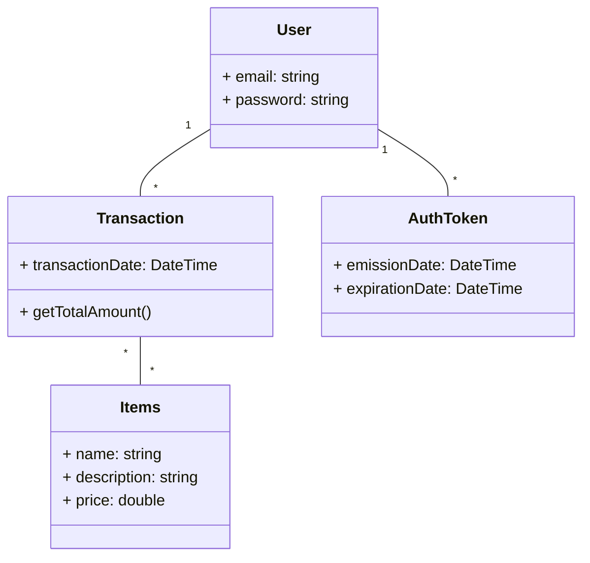

# Projet cleancqrs - BackEND - API in ASP.NET Core

CleanCQRS is an ASP.NET Core project designed according to the principles of Clean Architecture and implementing the CQRS (Command Query Responsibility Segregation) pattern. This project aims to demonstrate a modular, maintainable and scalable architecture, by clearly separating the responsibilities of commands and queries. 

The server project is written in C# using .NET Core with ASP.NET Core.

# I use mediatR for CQRS

<p align="center">
  
</p>

# Class UML



# To start API

## Deploy

You can deploy cleancqrs using Docker containers on Windows, macOS, and Linux distributions.

<p align="center">
    
  </a>
</p>

### Requirements

- [Docker](https://www.docker.com/community-edition#/download)
- [Docker Compose](https://docs.docker.com/compose/install/) (already included with some Docker installations)

### *⛔ Start the Database And Cache first before (in the folder DataBase)*

Start API .NET Core with Docker
```
docker compose -f .\compose.yaml up -d
```

**Clean the caches if that doesn't work :**

```
docker builder prune --force
```

**Otherwise do this manually if you don't have Docker**

*To play Migration (not necessary) in VS => Tools/Nuget Package Manager/ Package Manager Console.*
```
Add-Migration "BackendClass" -Project Infrastructure
```

*In prod, when you setup the secrets in Github Action, don't forget to set the connection DB escape special characters in your connection strings to prevent them from being interpreted as command separators in the shell*
```
ConnectionDB="Host=postgresdbsql\;Port=5432\;Username=tchoulo\;Password=123tchoulo123\;Database=devDB\;"
```

## Contribute

 Please commit all pull requests to the "main" branch. Please also commit all your development code to the "dev" branch.